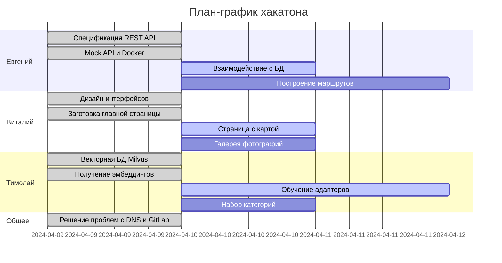

## Dockerized

### Using docker-compose

There is a prepared docker-compose configuration, so that you can just run

@NOTE: currently not working

```bash
docker compose up --build
```

Tweak port mapping and environment variables if necessary

### Диaграмма Гантта



### Отчет по первому дню

## Разработка REST API и бэкенд-часть:

- **Участник:** Евгений
- **Выполненные задачи:**
  - Продумана спецификация REST API для поиска по картинке и тексту.
  - Реализована моковая версия API.
  - Бэкенд развернут в контейнере для удобства работы над фронтендом.
- **Планы на следующий день:**
  - Выстраивание взаимодействия с БД.
  - Начало работы над задачей по построению маршрутов.

## Разработка фронтенда:

- **Участник:** Виталий
- **Выполненные задачи:**
  - Продуманы интерфейсы и нарисованы макеты.
  - Разработана заготовка главной страницы сайта с возможностью поиска достопримечательностей.
  - Фронтенд обернут в Docker, проверено взаимодействие с бэкендом.
- **Планы на следующий день:**
  - Создание полноценной страницы с картой, информацией о достопримечательностях и галереей фотографий.

## Работа с данными и архитектура нейросетей:

- **Участник:** Тимолай
- **Выполненные задачи:**
  - Выбрана векторная БД Milvus для поиска похожих достопримечательностей.
  - Развернута БД в контейнере.
  - Проработана архитектура нейросетей для получения эмбеддингов картинок и текста.
  - Получены эмбеддинги картинок для всех достопримечательностей.
- **Планы на следующий день:**
  - Начало обучения адаптеров для максимизации похожести между эмбеддингами текстов и картинок.
  - Продумывание набора категорий для достопримечательностей и методов их предсказания.
